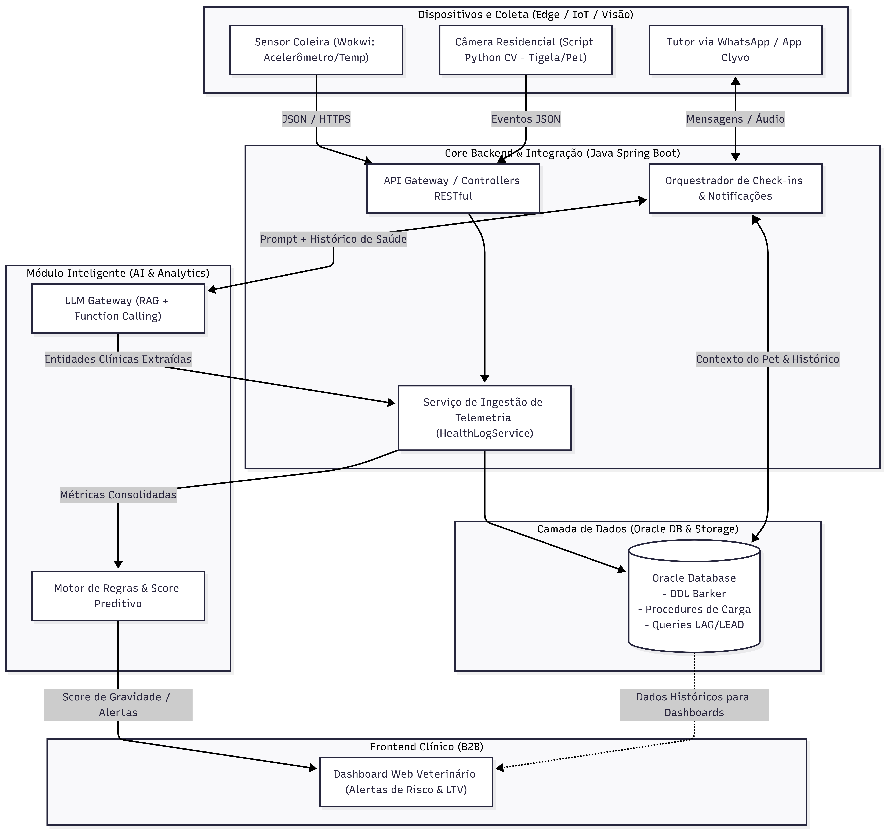

# Clyvo Care – Monitoramento Preditivo e Adesão Contínua (CLYVO VET)

> **Sprint 3 - Disruptive Architectures: IoT, IoB & Generative IA**  
> **FIAP 2026**

---

## 📌 1. Visão Geral e Problema de Negócio

### O Problema
No pós-operatório ou no tratamento de condições crônicas em clínicas veterinárias (como na **CLYVO VET**), a continuidade do cuidado é frequentemente interrompida após a alta. Há altos índices de **abandono do tratamento medicamentoso**, negligência em cuidados recomendados e grande dificuldade dos tutores em perceberem **sinais clínicos sutis** de piora (letargia, perda hídrica, redução de apetite, febre inicial). Isso gera complicações graves, reinternações de emergência evitáveis e perda de engajamento do cliente (baixo LTV).

### A Solução
O **Clyvo Care** é um ecossistema inteligente de monitoramento preventivo projetado com:
* **Interação Contínua (IoB / WhatsApp / App):** Triagens diárias conversacionais guiadas por IA para acolher o tutor e checar sinais vitais sem atrito.
* **Telemetria e Percepção Contínua (IoT & Visão Computacional):** Monitoramento ambiental e comportamental da atividade física e alimentação do pet.
* **Clinical Risk Dashboard (B2B):** Painel web veterinário com classificação preditiva de gravidade e priorização de retorno para a equipe médica.

---

## 🎯 2. Objetivos e Benefícios por Stakeholder

* **Para o Tutor:** Suporte contínuo, lembretes de medicação humanizados e redução de ansiedade sobre a recuperação do animal.
* **Para a Clínica Veterinária:** Priorização proativa de pacientes em risco, mitigação de reinternações críticas e aumento do *Lifetime Value* (LTV) através de consultas e exames preventivos gerados no momento certo.
* **Para o Pet:** Intervenção clínica oportuna, redução de dor e garantia de adesão rigorosa ao protocolo pós-alta.

---

## 🧠 3. Abordagem de Inteligência Artificial

Adota-se uma **arquitetura híbrida de Inteligência Artificial**, combinando processamento de linguagem natural com determinismo clínico:

1. **LLM com RAG (Retrieval-Augmented Generation) & Function Calling:**
   * **Função:** Condução de diálogos naturais com o tutor no canal de comunicação (WhatsApp/Chatbot).
   * **Papel do RAG:** Ancora as respostas estritamente no prontuário de alta gerado pelo veterinário da CLYVO VET, eliminando alucinações médicas.
   * **Function Calling:** Converte relatos informais em texto/áudio do tutor em estruturas de dados JSON estritas consumíveis por APIs.
2. **Motor Preditivo & Regras de Risco Clínico (Preditivo Multimodal):**
   * **Função:** Cálculo em tempo real do **Score de Gravidade Clínica (0 a 100)**.
   * **Cruzamento de Variáveis:** Combina frequência de ingestão (Visão Computacional), nível de atividade/temperatura (IoT) e sintomas extraídos pelo LLM para disparar alertas visuais no painel da clínica.

---

## 📊 4. Mapeamento e Estrutura de Dados

| Categoria | Dado Coletado | Origem | Formato / Estrutura | Utilização pela IA |
| :--- | :--- | :--- | :--- | :--- |
| **Perfil Base** | Espécie, raça, porte, idade, peso, comorbidades | Prontuário Clyvo Vet | `PetDTO` (JSON) | Parametrização dos limites vitais e tom do prompt |
| **Protocolo de Alta** | Medicamentos prescritos, horários, cirurgia realizada | Prontuário Clyvo Vet | `PrescriptionDTO` (JSON) | Base de conhecimento do RAG para checar adesão |
| **Telemetria IoT** | Temperatura corporal/ambiente e aceleração (atividade) | Sensor Wokwi (ESP32) | Payload JSON (MQTT/HTTP) | Detecção de febre, hipotermia ou letargia severa |
| **Visão Computacional** | Evento e duração de consumo na tigela de ração/água | Câmera IP / Script CV | Eventos JSON (`{event, duration_sec}`) | Correlação com apetite e hidratação do pet |
| **Diálogo do Tutor** | Descrição de dor, vômito, aspectos fisiológicos e humor | WhatsApp / App Clyvo | Mensagens de texto / áudio | Extração de entidades clínicas via LLM |

---

## 🏗️ 5. Arquitetura da Solução e Fluxo de Integração

O diagrama abaixo ilustra o fluxo completo da solução planejada para o projeto:

    
    
## 📂 6. Estrutura do Repositório (Sprint 3)
        
        Nesta sprint, o repositório disponibiliza a especificação arquitetural completa e a demonstração funcional em código (PoC) do componente de Inteligência Artificial:

        clyvo-care/
                    ├── ai-engine/
        │                   ├── ai_demo.py          # Demonstração funcional da extração via LLM e cálculo do Score de Risco
        │                   └── requirements.txt    # Dependências do módulo de IA (pydantic)
        └── README.md               # Documentação técnica e arquitetural da entrega

        Nota sobre o Roadmap de Integração:

        A implementação dos endpoints REST em Java Spring Boot, a modelagem física no Oracle DB e a orquestração via Docker/Cloud serão consolidadas na Sprint 4, onde a API consumirá este motor de IA.

        🚀 7. Como Executar a Demonstração de IA
            
            Pré-requisitos
            Python 3.10  ou superior

            Passo a Passo
            Clonar o repositório e entrar na pasta:

            git clone https://github.com/GeovanneCP/clyvo-care.git
            cd clyvo-care

            Instalar a dependência de validação:
            pip install -r ai-engine/requirements.txt

            Executar o script de demonstração:
            python ai-engine/ai_demo.py

            O terminal exibirá:

            O texto informal recebido do tutor via WhatsApp simulado;

            A recuperação do contexto da alta hospitalar do pet (RAG);

            A conversão do texto livre em um payload estruturado JSON via Function Calling/Pydantic;

            O cálculo multimodal do Score de Gravidade Clínica (0 a 100) integrando os dados de IoT e visão computacional simulados.

---

## 👥 Integrantes do Grupo

| Nome Completo | RM |
| :--- | :---: |
| **Geovanne Coneglian** | RM562673 |
| **Lucas Silva Gastão Pinheiro** | RM563960 |
| **Guilherme Soares De Alemida** | RM563143 |

---